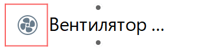
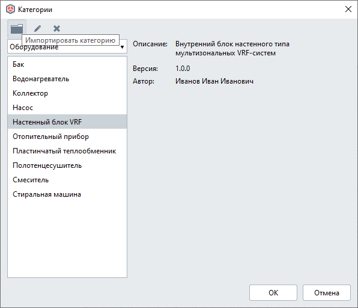
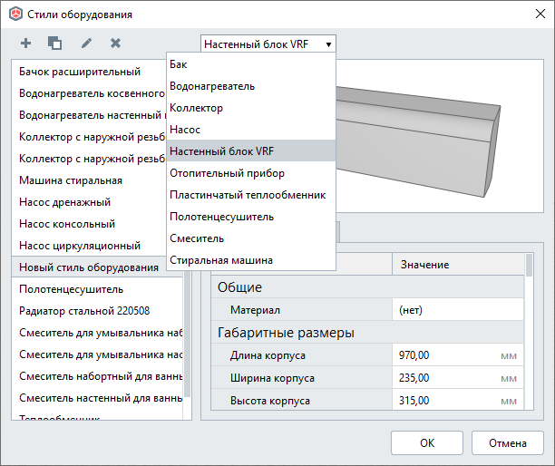

Введение
========

`Renga <https://rengabim.com/>`_ расширяет свои внутренние возможности по созданию пользовательских шаблонов стилей инженерного оборудования благодаря внешним STDL-cкриптам.

**Style Template Description Language** (**STDL**, *язык описания шаблона стиля*) — предметно-ориентированный язык на основе Lua, который представляет средства для описания шаблонов стиля с использованием встроенных возможностей Lua (условия, циклы и т.д.), набора функций для взаимодействия с Renga (создание и редактирование геометрии объекта с помощью пользовательских параметров, создание портов оборудования, управления отображением параметров в диалоге стиля).

Окружение
---------

Для описания шаблона стиля оборудования необходимо подготовить следующие файлы:

1. Файл ``parameters.json`` — для описания параметров оборудования.

Созданию параметров и использованию их в скриптах посвящена первая часть руководства :doc:`Параметризация <../createparams>`

2. Файл ``main.lua`` — непосредственно скриптовая часть, в которой описываются функции на языке Lua, для создания различного отображения оборудования в Renga (детальное, условное, символьное), а также его порты.

Обзору функций для взаимодействия с Renga посвящена вторая часть руководства :doc:`Обзор функций <../packages>`

.. note:: При написании скриптов рекомендуется руководствоваться специализированными справочниками, например, `Programming in Lua <https://www.lua.org/pil/contents.html>`_

3. Файл ``graph_icon.svg`` — условное изображение категории оборудования во вкладке соответствующей системы (см. `Справку Renga <https://help.rengabim.com/ru/index.htm#MEP_design.htm>`_). Пример:|pic1| 

Перед импортом в Renga три подготовленных файла должны быть скомпилированы в один файл с расширением ``.rst`` (**Renga Style Template**, *шаблон стиля Renga*) с помощью утилиты **RstBuilder**, которая входит в комплект поставки Renga.

.. note:: Работа с консольной утилитой RstBuilder подробно рассмотрена в главе :ref:`Компиляция в rst <rst_builder>` обучающего руководства.

Шаблон стиля Renga
------------------

Шаблон стиля в Renga формирует новую **категорию**, на основе которой можно создавать свои стили оборудования.

Импорт нового шаблона стиля оборудования в Renga осуществляется из меню "Управление стилями" — "Категории".

В дальней работе проектировщик сможет самостоятельно создавать свои стили на основе новой категории.

