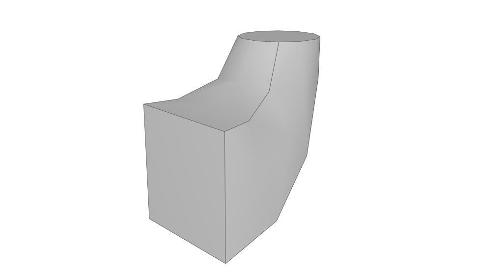

Твердотельная 3D-геометрия (класс Solid)
========================================

Общий класс **Solid** не имеет конструктора. Содержит функции, порождающие твердотельную геометрию. Служит для построения 3D-геометрии объектов.

Порождающие функции
-------------------

Параллелепипед
^^^^^^^^^^^^^^

Четырехугольная призма, все грани которой являются прямоугольниками (прямоугольный параллелепипед).

.. function:: Block(length, width, height)

    :param length: Задает длину параллелепипеда.
    :type length: Number
    :param width: Задает глубину параллелепипеда.
    :type width: Number
    :param height: Задает высоту параллелепипеда.
    :type height: Number
    :return: Твердотельная геометрия.
    :rtype: Solid

.. code-block:: lua
    :caption: Пример 1. Создание куба.
    :linenos:

    local detailedGeometry = ModelGeometry()
    local cubeSolid = Block(20, 20, 20)
    detailedGeometry:AddSolid(cubeSolid)
    Style.SetDetailedGeometry(detailedGeometry)

Результат:

.. image:: _static/Cube.png
    :height: 230 px
    :width: 400 px
    :align: center

.. code-block:: lua
    :caption: Пример 2. Создание параллелепипеда.
    :linenos:

    local detailedGeometry = ModelGeometry()
    local boxSolid = Block(40, 15, 20)
    detailedGeometry:AddSolid(boxSolid)
    Style.SetDetailedGeometry(detailedGeometry)

Результат:

.. image:: _static/Box.png
    :height: 230 px
    :width: 400 px
    :align: center

Сфера
^^^^^

.. function:: Sphere(radius)

    :param radius: Задает радиус сферы.
    :type radius: Number
    :return: Твердотельная геометрия.
    :rtype: Solid

.. code-block:: lua
    :caption: Пример 3.
    :linenos:

    local detailedGeometry = ModelGeometry()
    local bearingSolid = Sphere(10)
    detailedGeometry:AddSolid(bearingSolid:HideSmoothEdges())
    Style.SetDetailedGeometry(detailedGeometry)

Результат:

.. image:: _static/Sphere.png
    :height: 230 px
    :width: 400 px
    :align: center

Цилиндр
^^^^^^^

Тело, ограниченное цилиндрической поверхностью и двумя параллельными плоскостями, пересекающими её.

.. function:: Cylinder(radius, height)

    :param radius: Задает радиус цилиндра.
    :type radius: Number
    :param height: Задает высоту цилиндра.
    :type height: Number
    :return: Твердотельная геометрия.
    :rtype: Solid

.. code-block:: lua
    :caption: Пример 4.
    :linenos:

    local detailedGeometry = ModelGeometry()
    local pinSolid = Cylinder(10, 40)
    detailedGeometry:AddSolid(pinSolid:HideSmoothEdges())
    Style.SetDetailedGeometry(detailedGeometry)

Результат:

.. image:: _static/Cylinder.png
    :height: 230 px
    :width: 400 px
    :align: center

Конус
^^^^^

Прямой конус, основанием которого является окружность и ортогональная проекция вершины конуса на плоскость основания совпадает с этим центром.

.. function:: Cone(radius, height)

    :param radius: Задает радиус конуса.
    :type radius: Number
    :param height: Задает высоту конуса.
    :type height: Number
    :return: Твердотельная геометрия.
    :rtype: Solid

.. code-block:: lua
    :caption: Пример 5.
    :linenos:

    local detailedGeometry = ModelGeometry()
    local coneSolid = Cone(10, 40)
    detailedGeometry:AddSolid(coneSolid:HideSmoothEdges())
    Style.SetDetailedGeometry(detailedGeometry)

Результат:

.. image:: _static/Cone.png
    :height: 230 px
    :width: 400 px
    :align: center

Усеченный конус
^^^^^^^^^^^^^^^

Часть конуса, лежащая между основанием и плоскостью, параллельной основанию и находящейся между вершиной и основанием.

.. function:: ConicalFrustum(bottomRadius, topRadius, height)

    :param bottomRadius: Задает радиус основания усеченного конуса.
    :type bottomRadius: Number
    :param topRadius: Задает радиус верха усеченного конуса.
    :type topRadius: Number    
    :param height: Задает высоту усеченного конуса.
    :type height: Number
    :return: Твердотельная геометрия.
    :rtype: Solid

.. code-block:: lua
    :caption: Пример 6.
    :linenos:

    local detailedGeometry = ModelGeometry()
    local fillerSolid = ConicalFrustum(10, 5, 20)
    detailedGeometry:AddSolid(fillerSolid:HideSmoothEdges())
    Style.SetDetailedGeometry(detailedGeometry)

Результат:

.. image:: _static/ConicalFrustum.png
    :height: 230 px
    :width: 400 px
    :align: center

Пирамида с прямоугольным основанием
^^^^^^^^^^^^^^^^^^^^^^^^^^^^^^^^^^^

Основанием пирамиды является прямоугольник.

.. function:: Pyramid(sizeX, sizeY, height)

    :param sizeX: Задает размер основания пирамиды по оси X.
    :type sizeX: Number
    :param sizeY: Задает размер основания пирамиды по оси Y.
    :type sizeY: Number    
    :param height: Задает высоту пирамиды.
    :type height: Number
    :return: Твердотельная геометрия.
    :rtype: Solid

.. code-block:: lua
    :caption: Пример 7.
    :linenos:

    local detailedGeometry = ModelGeometry()
    local baseSolid = Pyramid(25, 15, 20)
    detailedGeometry:AddSolid(baseSolid)
    Style.SetDetailedGeometry(detailedGeometry)

Результат:

.. image:: _static/Pyramid.png
    :height: 230 px
    :width: 400 px
    :align: center

.. _extrusion:

Тело выдавливания
^^^^^^^^^^^^^^^^^

.. function:: ExtrudedSolid(contour, direction, params)

    :param contour: Задает плоский контур выдавливания.
    :type contour: :ref:`Curve2D <curve2d>`   
    :param direction: Задает направление выдавливания.
    :type direction: :ref:`Vector3D <vector3d>`
    :param params: Задает дополнительные параметры построения.
    :type params: :ref:`ExtrusionValues <extrusionval>`
    :return: Твердотельная геометрия.
    :rtype: Solid

    .. _extrusionval:

    Дополнительные параметры построения
    """""""""""""""""""""""""""""""""""

    Конструктор:

    .. function:: ExtrusionValues(forwardDepth, backwardDepth)

        :param forwardDepth: Задает глубину выдавливания в прямом направлении.
        :type forwardDepth: Number
        :param backwardDepth: Задает глубину выдавливания в обратном направлении.
        :type backwardDepth: Number

        :Поля:            
            * **thickness1** (*Number*) — Задает отступ наружу от образующей кривой (по умолчанию 0)
            * **thickness2** (*Number*) — Задает отступ внутрь от образующей кривой (по умолчанию 0)
            * **forwardAngle** (*Number*) — Задает угол наклона при выдавливании в прямом направлении (по умолчанию 0)
            * **backwardAngle** (*Number*) — Задает угол наклона при выдавливании в обратном направлении (по умолчанию 0)
        

.. code-block:: lua
    :caption: Пример 8. Построение полнотелого тела, путем задания контура и направления выдавливания - вертикально вверх.
    :linenos:

    local detailedGeometry = ModelGeometry()
    local points = {
        Point2D(0, 0),
        Point2D(0, 10),
        Point2D(10, 10),
        Point2D(10, 8),
        Point2D(8, 8),
        Point2D(8, 6),
        Point2D(6, 6),
        Point2D(6, 4),
        Point2D(4, 4),
        Point2D(4, 2),
        Point2D(2, 2),
        Point2D(2, 0)}
    local extrusionContour = ClosedContourByPoints(points)
    local params = ExtrusionValues(40, 0)   -- глубина выдавливания в прямом направлении = 40
    local moldingSolid = ExtrudedSolid(extrusionContour,
                                       Vector3D(0, 0, 1),
                                       params)
    detailedGeometry:AddSolid(moldingSolid)
    Style.SetDetailedGeometry(detailedGeometry)

Результат:

.. image:: _static/Extrusion.png
    :height: 230 px
    :width: 400 px
    :align: center

.. code-block:: lua
    :caption: Пример 9. Построение тонкостенного тела, путем задания контура и направления выдавливания - вертикально вверх.
    :linenos:

    local detailedGeometry = ModelGeometry()
    local points = {
        Point2D(0, 0),
        Point2D(0, 10),
        Point2D(10, 10),
        Point2D(10, 8),
        Point2D(8, 8),
        Point2D(8, 6),
        Point2D(6, 6),
        Point2D(6, 4),
        Point2D(4, 4),
        Point2D(4, 2),
        Point2D(2, 2),
        Point2D(2, 0)}
    local profileContour = ClosedContourByPoints(points)
    local params = ExtrusionValues(15, 0)   -- глубина выдавливания в прямом направлении = 15
    params.thickness1 = params.thickness2 = 0.5 -- толщина отступа наружу и внутрь относительно заданного контура = 0.5
    local thinSolid = ExtrudedSolid(profileContour,
                                    Vector3D(0, 0, 1),
                                    params)
    detailedGeometry:AddSolid(thinSolid)
    Style.SetDetailedGeometry(detailedGeometry)

Результат:

.. image:: _static/ExtrusionWithThickness.png
    :height: 230 px
    :width: 400 px
    :align: center

Построение тела по плоским сечениям
^^^^^^^^^^^^^^^^^^^^^^^^^^^^^^^^^^^

.. function:: LoftedSolid({profiles}, {placements})

    :param {profiles}: Задает таблицу плоских контуров.
    :type {profiles}: table of :ref:`Curves2D <curve2d>`   
    :param {placements}: Задает таблицу координатных плоскостей в 3D пространстве.
    :type {placements}: table of :ref:`Placements3D <placement3d>`
    :return: Твердотельная геометрия.
    :rtype: Solid

.. code-block:: lua
    :caption: Пример 10.
    :linenos:

    local detailedGeometry = ModelGeometry()
    local profiles = {
        Rectangle(30, 30),
        Circle(Point2D(0, 0), 10)}
    local placements = {
        Placement3d(Point3D(0, 0, 0),
                    Vector3D(1, 0, 0),
                    Vector3D(0, 1, 0)),
        Placement3d(Point3D(40, 0, 0),
                    Vector3D(1, 0, 0),
                    Vector3D(0, 1, 0))}
    local loftedSolid = LoftedSolid(profiles, placements)
    detailedGeometry:AddSolid(loftedSolid)
    Style.SetDetailedGeometry(detailedGeometry)

Результат:

.. image:: _static/CreateLoftedSolid.png
    :height: 230 px
    :width: 400 px
    :align: center

Построение кинематического тела путем движения образующей кривой вдоль направляющей кривой
^^^^^^^^^^^^^^^^^^^^^^^^^^^^^^^^^^^^^^^^^^^^^^^^^^^^^^^^^^^^^^^^^^^^^^^^^^^^^^^^^^^^^^^^^^

.. function:: LoftedSolidByProfilesAndPath(startProfile, endProfile, path)

    :param startProfile: Задает плоский контур в начале.
    :type startProfile: :ref:`Curve2D <curve2d>`   
    :param endProfile: Задает плоский контур в конце.
    :type endProfile: :ref:`Curve2D <curve2d>`
    :param path: Задает путь движения в виде трехмерной кривой.
    :type path: :ref:`Curve3D <curve3d>`
    :return: Твердотельная геометрия.
    :rtype: Solid

.. code-block:: lua
    :caption: Пример 11.
    :linenos:

    local detailedGeometry = ModelGeometry()
    local startProfile = Rectangle(30, 30)
    local endProfile = Circle(Point2D(0, 0), 10)
    local arc2D = ArcByCenter(Point2D(0, 0),
                              Point2D(-30, 0),
                              Point2D(0, 30),
                              true)
    local arc3D = Curve3dByCurveAndPlacement(arc2D,
                                             Placement3D(Point3d(0, 0, 0),
                                                         Vector3d(0, -1, 0),
                                                         Vector3d(0, 0, 1)))
    local loftedSolid = LoftedSolidByProfilesAndPath(startProfile, endProfile, arc3D)
    detailedGeometry:AddSolid(loftedSolid)
    Style.SetDetailedGeometry(detailedGeometry)

Результат:

Тело вращения
^^^^^^^^^^^^^

Вращение плоского замкнутого контура вокруг заданной оси на указанный угол.

.. function:: Revolution(placement, contour, origin, vector, counterClockwiseAngle, clockwiseAngle)

    :param placement: Задает координатную плоскость.
    :type placement: :ref:`Placement3D <placement3d>`
    :param contour: Задает плоский контур.
    :type contour: :ref:`Curve2D <curve2d>`
    :param origin: Задает точку начала вектора вращения.
    :type origin: :ref:`Point3D <point3d>`
    :param vector: Задает вектор оси вращения.
    :type vector: :ref:`Vector3D <vector3d>`
    :param counterClockwiseAngle: Задает угол вращения против часовой стрелки.
    :type counterClockwiseAngle: Number
    :param clockwiseAngle: Задает угол вращения по часовой стрелке.
    :type clockwiseAngle: Number

.. code-block:: lua
    :caption: Пример 12.
    :linenos:

    local detailedGeometry = ModelGeometry()
    local placement = Placement3D(Point3D(0, 0, 0),
                                  Vector3D(1, 0, 0),
                                  Vector3D(0, 1, 0))
    local contour = Rectangle(6, 15):FilletNth(3, 3):FilletNth(5, 3)
    local revolutionSolid = Revolution(placement,
                                       contour,
                                       Point3D(0, 10, 0),
                                       Vector3D(0, -0.5, 1),
                                       0,
                                       270)
    detailedGeometry:AddSolid(loftedSolid:HideSmoothEdges())
    Style.SetDetailedGeometry(detailedGeometry)

Результат:

.. image:: _static/Revolution.png
    :height: 230 px
    :width: 400 px
    :align: center

Методы класса
-------------

Общие методы твердотельной геометрии Solid.

* Сместить по осям X, Y, Z

.. function:: :Shift(dX, dY, dZ)

    :param dX: Задает смещение по оси X.
    :type dX: Number
    :param dY: Задает смещение по оси Y.
    :type dY: Number
    :param dZ: Задает смещение по оси Z.
    :type dZ: Number

* Повернуть относительно оси

.. function:: :Rotate(axis, angle)

    :param axis: Задает ось вращения.
    :type axis: :ref:`Axis <axis>`
    :param angle: Задает угол поворота.
    :type angle: Number

* Разместить в относительной системе координат

.. function:: :SetPlacement(placement)

    :param placement: Задает координатную систему в 3D пространстве.
    :type placement: :ref:`Placement3D <placement3d>`

* Скрытие ребер

.. function:: :HideSmoothEdges()

Операторы
---------

* Булевое сложение

.. function:: +

Пример кода:

.. code-block:: lua
    :caption: Пример 13.
    :linenos:

    local detailedGeometry = ModelGeometry()
    local cube = Cube(20)
    local sphere = Sphere(10)
    detailedGeometry:AddSolid(cube + sphere:Shift(10, 0, 10):HideSmoothEdges())
    Style.SetDetailedGeometry(detailedGeometry)   

Результат:

.. image:: _static/Add_3D.png
    :height: 230 px
    :width: 400 px
    :align: center

* Булевое вычитание

.. function:: -

Пример кода:

.. code-block:: lua
    :caption: Пример 14.
    :linenos:

    local detailedGeometry = ModelGeometry()
    local cube = Cube(20)
    local sphere = Sphere(10)
    detailedGeometry:AddSolid(cube - sphere:Shift(10, 0, 10):HideSmoothEdges())
    Style.SetDetailedGeometry(detailedGeometry)

Результат:

.. image:: _static/Sub_3D.png
    :height: 230 px
    :width: 400 px
    :align: center