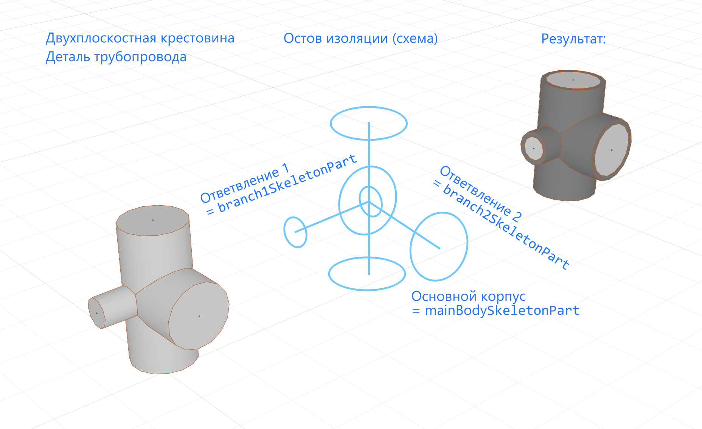

Остов изоляции
==============

Начиная с версии Renga 8.9 и новее появилась возможность задавать техническую изоляцию у инженерного оборудования в проектах пользователей.
Чтобы можно было смоделировать изоляцию необходимо описать **остов изоляции** в шаблоне стилей для следующих типов объектов:

1. Аксессуар трубопровода
2. Деталь трубопровода
3. Аксессуар воздуховода
4. Деталь воздуховода

Задается с помощью функции :ref:`SetInsulationSkeleton <insulationskeleton>` пространства имён ``Style``.

Остов изоляции может состоять из нескольких участков, каждый из которых задается таблицей.

.. code-block:: lua
    :caption: Пример определения.

    parts = { startpart = {}, nextpart = {}, ... , endpart = {} }

.. _insulationparts:

Участок изоляции
^^^^^^^^^^^^^^^^

Каждый участок задается массивом параметров.

.. lua:function:: {{contours}, {placements}, guideCurve, capTypeStart, capTypeEnd}

    :param {contours}: Задает таблицу плоских контуров сечений изоляции.
    :type {contours}: table of :ref:`Curves2D <curve2d>`
    :param {placements}: Задает таблицу координатных плоскостей в 3D пространстве, в плоскости XY которых располагаются контура сечений.
    :type {placements}: table of :ref:`Placements3D <placement3d>`
    :param guideCurve: Задает направляющую трёхмерную кривую.
    :type guideCurve: :ref:`Curve3D <curve3d>`
    :param capTypeStart: Тип заглушки в начале направляющей кривой. По умолчанию - InsulationCapType.None
    :type capTypeStart: Enum
    :param capTypeEnd: Тип заглушки в конце направляющей кривой. По умолчанию - InsulationCapType.None
    :type capTypeEnd: Enum

.. note:: 
    Контур сечения должен быть замкнут.
    
    Размер массива ``contours`` должен быть равен размеру массива ``placements``

.. table:: Тип заглушки InsulationCapType

    +------------------+---------------------------+
    | идентификатор    | описание                  |
    +==================+===========================+
    | None             | без изоляции              |
    +------------------+---------------------------+
    | Flat             | закрыта плоской изоляцией |
    +------------------+---------------------------+

.. code-block:: lua
    :caption: Пример. Остов изоляции для двухплоскостной крестовины
    :linenos:

    -- Получаем таблицу параметров из текущего стиля
    local parameters = Style.GetParameterValues()
    -- Получаем таблицу Dimensions, содержащую геометрические параметры 
    local dimensions = parameters.Dimensions

    -- Создаем остов изоляции для основной части крестовины
    -- Круглый контур, т.к. это деталь трубопровода
    local mainBodyContour = CreateCircle2D(Point2D(0, 0),
                                dimensions.CrossOutsideDiameter / 2)
    -- 3-х мерная система координат по умолчанию
    local mainBodyPlacement = Placement3D(Point3D(0, 0, 0),
                                Vector3D(1, 0, 0), Vector3D(0, 0, -1))
    -- Направляющая кривая
    local mainBodyGuideCurve = CreateLineSegment3D(Point3D(-dimensions.InletToCenterDistance, 0, 0),
                                Point3D(dimensions.InletToCenterDistance, 0, 0))
    -- Таблица основного участка остова изоляции
    local mainBodySkeletonPart = {
        {mainBodyContour, mainBodyContour},
        {mainBodyPlacement:Clone():Shift(-dimensions.InletToCenterDistance, 0, 0),
            mainBodyPlacement:Clone():Shift(dimensions.InletToCenterDistance, 0, 0)},
        mainBodyGuideCurve,
        InsulationCapType.None, -- По умолчанию None, поэтому можно не указывать
        InsulationCapType.None  -- По умолчанию None, поэтому можно не указывать
    }

    -- Создаем остов изоляции для первого ответвления крестовины
    local branch1Contour = CreateCircle2D(Point2D(0, 0),
                                dimensions.Branch1OutsideDiameter / 2)
    local branch1Placement = mainBodyPlacement
    local branch1GuideCurve = CreateLineSegment3D(Point3D(0, 0, 0),
                                Point3D(dimensions.CenterToBranch1Distance, 0, 0))
    -- Таблица участка остова изоляции для первого ответвления
    local branch1SkeletonPart = {
        {branch1Contour, branch1Contour},
        {branch1Placement:Clone():Transform(branch1Rotator),
            branch1Placement:Clone():Shift(dimensions.CenterToBranch1Distance, 0, 0):Transform(branch1Rotator)},
        branch1GuideCurve
        -- Если оба конца части не заглушаются изоляцией, то можно не указывать InsulationCapType
    }

    -- Создаем остов изоляции для второго ответвления крестовины
    local branch2Contour = CreateCircle2D(Point2D(0, 0),
                                dimensions.Branch2OutsideDiameter / 2)
    local branch2Placement = mainBodyPlacement
    local branch2GuideCurve = CreateLineSegment3D(Point3D(0, 0, 0),
                                Point3D(dimensions.CenterToBranch2Distance, 0, 0))
    -- Таблица участка остова изоляции для второго ответвления
    local branch2SkeletonPart = {
        {branch2Contour, branch2Contour},
        {branch2Placement:Clone():Transform(branch2Rotator),
            branch2Placement:Clone():Shift(dimensions.CenterToBranch2Distance, 0, 0):Transform(branch2Rotator)},
        branch2GuideCurve
    }

    -- Задаем остов изоляции стиля
    Style.SetInsulationSkeleton({mainBodySkeletonPart, branch1SkeletonPart, branch2SkeletonPart})