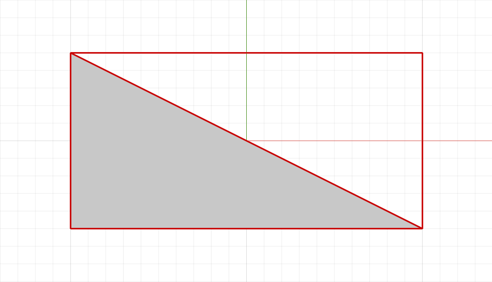

Плоская геометрия (класс PlanarGeometry)
========================================

Общий класс **PlanarGeometry** не имеет конструктора. Служит для создания условного или символьного уровня детализации стиля. В зависимости от нужного поведения на видах (планах, разрезах, аксонометрических видах) порождает несколько видов плоской геометрии (см. **Порождающие функции**).
Плоская геометрия является контейнером, вмещающим в себя графические примитивы (из которых будет состоять УГО) таких типов, как:

* :ref:`Двумерные кривые <curve2d>`
* :ref:`Двумерные регионы <fillarea>`

.. code-block:: lua
    :caption: Пример 1. Создание плоской геометрии, состоящей из 2-х кривых и одного региона.
    :linenos:

    local symbolGeometry = ModelGeometry()
    local planarGeometry = PlanarGeometryPlane()    
    planarGeometry:AddCurve(Rectangle(20, 10))
    planarGeometry:AddCurve(LineSegment(Point2D(10, -5),
                                        Point2D(-10, 5)))
    planarGeometry:AddHatchBasic(FillArea({ContourByPoints({Point2D(10, -5),
                                                            Point2D(-10, 5),
                                                            Point2D(-10, -5)})}))
    symbolGeometry:AddPlanarGeometry(planarGeometry:SetUnscalable(true))
    Style.SetSymbolGeometry(symbolGeometry)

Результат:

Порождающие функции
-------------------

Плоская геометрия, ориентированная по направлению осей
^^^^^^^^^^^^^^^^^^^^^^^^^^^^^^^^^^^^^^^^^^^^^^^^^^^^^^

Наследует положение объекта и направление осей. Статична и всегда повёрнута в одну сторону, которую задаёт метод ``SetPlacement()``

.. note:: В основном используется в условном отображении оборудования

.. lua:function:: PlanarGeometryPlane()

Пример поведения:

.. figure:: _static/PlanarGeometryPlane.png
    :alt: PlanarGeometryPlane
    :figwidth: 90%

    УГО оборудования ориентировано по направлению самого оборудования (на всех видах)

.. _planargeometryaxis90:

Плоская геометрия, ориентированная по направлению оси X, угол поворота кратен 90 градусам
^^^^^^^^^^^^^^^^^^^^^^^^^^^^^^^^^^^^^^^^^^^^^^^^^^^^^^^^^^^^^^^^^^^^^^^^^^^^^^^^^^^^^^^^^

Наследует положение объекта и направление оси X. Ось Z направлена в сторону камеры, если это возможно. Угол поворота кратен 90 градусам.

.. note:: В основном используется в символьном и условном отображении аксессуаров трубопроводов и воздуховодов

.. lua:function:: PlanarGeometryAxis90()

Пример поведения:

.. figure:: _static/PlanarGeometryAxis90.png
    :alt: PlanarGeometryAxis90
    :figwidth: 90%

    УГО оборудования ориентировано по оси X оборудования и (где возможно) разворачивается на 90 градусов к камере

Плоская геометрия, ориентированная по направлению глобальной оси Z
^^^^^^^^^^^^^^^^^^^^^^^^^^^^^^^^^^^^^^^^^^^^^^^^^^^^^^^^^^^^^^^^^^

Наследует положение объекта. Нормаль ориентирована в сторону глобальной оси Z.

Плоская геометрия, которая ориентирована только вверх (ось Z) ЛСК проекта. Т.е. видна только на проекциях сверху (планах), при проецировании сбоку (разрез) вырождается в линию.

.. note:: Используется для создания символьного отображения оборудования электрических систем и вспомогательной геометрии в 3D

.. lua:function:: PlanarGeometryGlobalZ()

Пример поведения:

.. figure:: _static/PlanarGeometryGlobalZ.png
    :alt: PlanarGeometryGlobalZ
    :figwidth: 90%

    УГО оборудования ориентировано только вверх ЛСК проекта

Методы класса
-------------

Методы плоской геометрии PlanarGeometry.

* Сместить по осям X, Y

.. lua:method:: :Shift(dX, dY)

    :param dX: Задает смещение по оси X.
    :type dX: Number
    :param dY: Задает смещение по оси Y.
    :type dY: Number

* Повернуть относительно точки

.. lua:method:: :Rotate(point, angle)

    :param point: Задает точку-центр вращения.
    :type point: :ref:`Point2D <point2d>`
    :param angle: Задает угол поворота.
    :type angle: Number

* Масштабировать по двум осям относительно указанной точки

.. lua:method:: :Scale(point, scaleX, scaleY)

    :param point: Задает точку, относительно которой будет масштабироваться кривая.
    :type point: :ref:`Point2D <point2d>`
    :param scaleX: Задает коэффициент масштабирования по оси X.
    :type scaleX: Number
    :param scaleY: Задает коэффициент масштабирования по оси Y.
    :type scaleY: Number

* Добавить кривую к плоской геометрии

.. lua:method:: :AddCurve(curve)

    :param curve: Задает двухмерную кривую.
    :type curve: :ref:`Curve2D <curve2d>`

* Добавить регион к основной штриховке

.. lua:method:: :AddHatchBasic(region)

    :param region: Задает двухмерный регион.
    :type region: :ref:`FillArea <fillarea>`

* Добавить регион к дополнительной штриховке

.. lua:method:: :AddHatchExtra(region)

    :param region: Задает двухмерный регион.
    :type region: :ref:`FillArea <fillarea>`

* Задать ЛСК для построения плоской геометрии

.. lua:method:: :SetPlacement(placement)

    :param placement: Задает трёхмерную локальную систему координат.
    :type placement: :ref:`Placement3D <placement3d>`

* Задать возможность масштабирования геометрии

.. lua:method:: :SetUnscalable(bool)

    :param bool: True - геометрия не масштабируется. False - масштабируется.
    :type bool: Boolean

* Задать приоритет геометрии по оси Z

.. lua:method:: :SetZIndex(bool)

    :param bool: True - приоритет задан. False - не задан.
    :type bool: Boolean