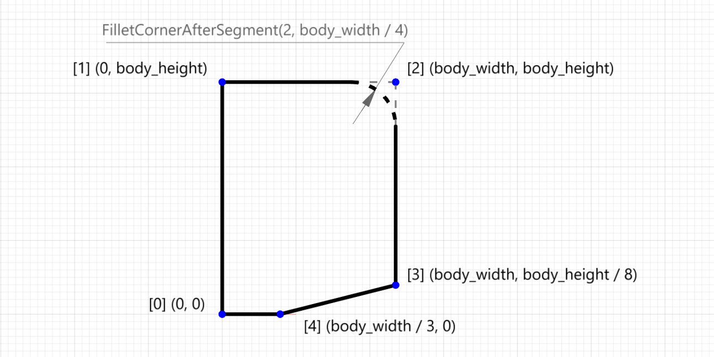
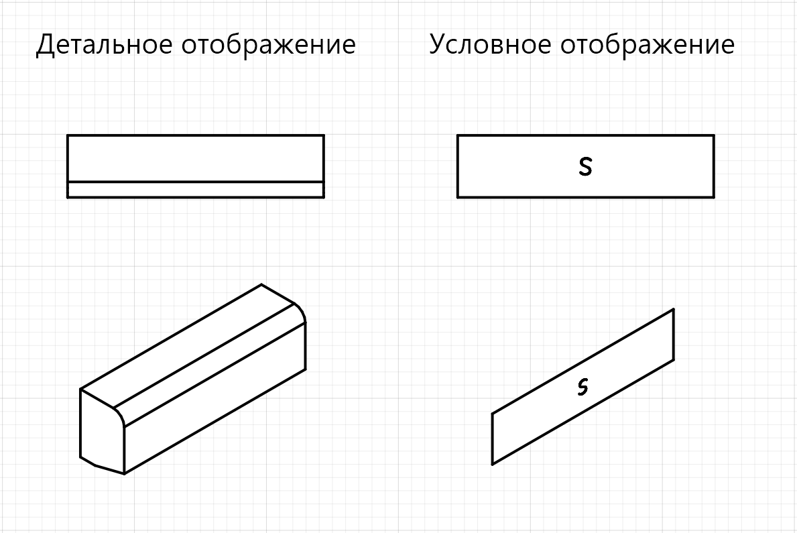
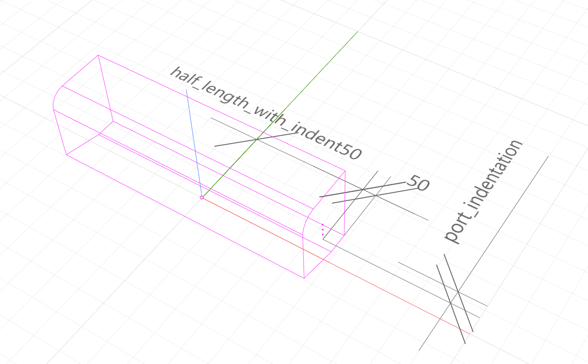
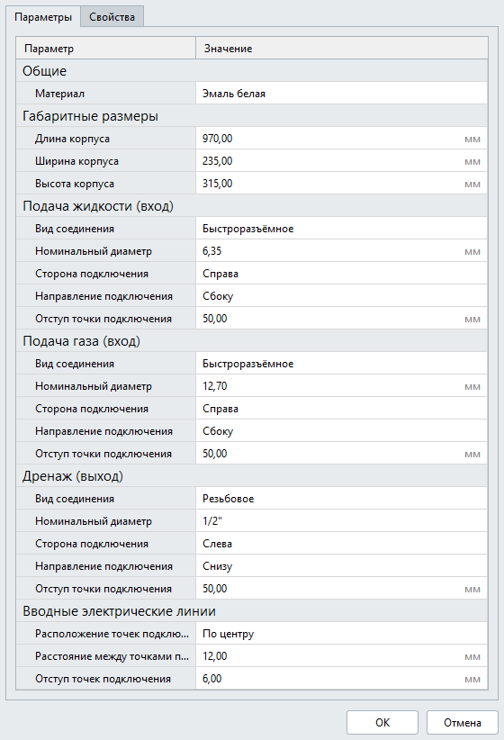

main.lua
========

Перейдём к описанию динамической части описания шаблонной категории. Это создание скрипта на языке Lua, создающий на основе параметров из ``parameters.json`` категорию объекта 

Создание детальной 3D-геометрии
-------------------------------

1. Создадим экземпляр класса ``ModelGeometry``, в котором будем "собирать" детальный уровень детализации. Кроме того объявим несколько локальных переменных, которые помогут проще писать скрипт.

.. code-block:: lua
    :caption: Объявление локальных переменных.
    :linenos:

    local detailedGeometry = ModelGeometry()
    local height = Style.Parameters.Dimensions.body_height
    local width = Style.Parameters.Dimensions.body_width
    local length = Style.Parameters.Dimensions.body_length

Корпус настенного блока VRF-системы будет создан телом выдавливания :ref:`ExtrudedSolid <extrusion>`.

2. Создадим функцию ``makeProfile()``, которая будет создавать пятиугольник по точкам — замкнутый контур :ref:`ContourByPoints <closed_contour>`. Координаты точек будут определяться параметрами ``height`` и ``width``:

.. code-block:: lua
    :caption: Функция ``makeProfile()``, создающая профиль корпуса оборудования.
    :linenos:

    local function makeProfile()
        local points = {
            Point2D(0, 0),
            Point2D(0, height),
            Point2D(width, height),
            Point2D(width, height / 8),
            Point2D(width / 3, 0)}
        return ContourByPoints(points)
            :FilletCornerAfterSegment(2, width / 4)
    end

Метод ``FilletCornerAfterSegment`` скругляет вершину контура с индексом [2] по радиусу, равным ``width`` / 4.

    Профиль корпуса оборудования

3. Далее создадим тело выдавливания :ref:`ExtrudedSolid <extrusion>` на длину ``length``, разместим его в своей локальной системе координат ``placement`` с помощью метода ``SetPlacement`` и добавим полученное тело в модельную геометрию ``detailedGeometry`` с помощью метода ``AddSolid``.

.. code-block:: lua
    :caption: Добавление тела в модельную геометрию ``detailedGeometry``.
    :linenos:

    local placement = Placement3D(
        Point3D(0, 0, 0),
        Vector3D(-1, 0, 0),
        Vector3D(0, -1, 0))
    local params = ExtrusionValues(length, 0)

    local vrfSolid = ExtrudedSolid(makeProfile(), Vector3D(0, 0, 1), params)
        :SetPlacement(placement)
        :ShiftTransform(length / 2, width / 2, 0)

    detailedGeometry:AddSolid(vrfSolid)

.. note:: Центр геометрического примитива создается в начале координат своей ЛСК.
    
Выдавливание профиля выполняется относительно локальной оси Z, т.е. вертикально. С помощью метода ``SetPlacement`` мы задаем новую ЛСК, в которой тело ориентируется горизонально (поворачиваем оси).

4. Для создания детальной геометрии стиля, передадим модельную геометрию ``detailedGeometry`` в качестве аргумента функции SetDetailedGeometry.

.. code-block:: lua
    :caption: Создание детальной геометрии стиля.
    :linenos:

    Style.SetDetailedGeometry(detailedGeometry)

Создание условного изображения
------------------------------

5. В начале создадим экземпляр класса ModelGeometry, в котором будем "собирать" условную геометрию стиля, а также несколько примитивов из плоских кривых: ``contour`` — для создания прямоугольного контура оборудования и ``letterS`` — для создания буквы "S".

.. code-block:: lua
    :caption: Создание плоских кривых ``contour`` и ``letterS``.
    :linenos:

    local symbolicGeometry = ModelGeometry()
    local contour = Rectangle(length, width)
    local letterS = ArcBy3Points(Point2D(19.4, 23), Point2D(4.2, 30.4), Point2D(-12, 26))
                  + ArcBy3Points(Point2D(-12, 26), Point2D(-16.4, 14.2), Point2D(-9, 4.2))
                  + LineSegment(Point2D(-9, 4.2), Point2D(9, -4.2))
                  + ArcBy3Points(Point2D(9, -4.2), Point2D(16.4, -14.2), Point2D(12, -26))
                  + ArcBy3Points(Point2D(12, -26), Point2D(-4.2, -30.4), Point2D(-19.4, -23))

Многосегментная кривая ``letterS`` создается из 5-ти отдельных односегментных кривых, путем булевого сложения.

6. Условное изображение категории будет плоской геометрией :ref:`PlanarGeometryAxis90() <planargeometryaxis90>`. Поместим созданные кривые в плоскую геометрию с помощью метода ``AddCurves`` и добавим основную заливку с помощью метода ``AddHatchBasic``.

.. code-block:: lua
    :caption: Создание плоской геометрии.
    :linenos:

    local geometry = PlanarGeometryAxis90()
    geometry:AddCurve(contour):AddCurve(letterS)
    geometry:AddHatchBasic(FillArea({contour}))
    geometry:SetPlacement(Placement3D(Point3D(0, 0, 0), Vector3D(0, -1, 0), Vector3D(1, 0, 0)))
    symbolicGeometry:AddPlanarGeometry(geometry)

Cозданную плоскую геометрию ``geometry`` добавляем в модельную геометрию ``symbolicGeometry`` с помощью метода ``AddPlanarGeometry``.

7. Для создания условной геометрии стиля, передадим модельную геометрию ``symbolicGeometry`` в качестве аргумента функции SetSymbolicGeometry.

.. code-block:: lua
    :caption: Создание условной геометрии стиля.
    :linenos:

    Style.SetSymbolicGeometry(symbolicGeometry)

    Детальное и условное отображение

Создание портов
---------------

Создание портов трубопроводных систем
"""""""""""""""""""""""""""""""""""""

8. Объявим несколько локальных переменных, которые помогут создать декартовы точки портов.

.. note:: Порты размещаются по-умолчанию в центре ЛСК

.. code-block:: lua
    :caption: Объявление локальных переменных.
    :linenos:

    local halfWidth = width / 2
    local halfLengthWithIndent50 = length / 2 - 50
    local waterPortIntendation = Style.Parameters.WaterCoolant.port_indentation
    local gasPortIntendation = Style.Parameters.GasCoolant.port_indentation
    local drainagePortIntendation = Style.Parameters.Drainage.port_indentation

    -- декартовы точки по-умолчанию
    local waterCoolantOrigin = Point3D(0, 0, 0)
    local gasCoolantOrigin = Point3D(0, 0, 0)
    local drainageOrigin = Point3D(0, 0, 0)

9. Следующая часть кода размещает декартовы точки портов в зависимости от параметра ``connection_side``: слева или справа относительно центра корпуса оборудования. Координату X определяет переменная ``halfLengthWithIndent50``, координата Y высчитывается с учетом параметра отступа ``port_indentation``, а координаты Z — фиксированы (25, 50 и 75).

.. code-block:: lua
    :caption: Размещение декартовых точек портов с учетом параметра ``connection_side``.
    :linenos:

    if Style.Parameters.WaterCoolant.connection_side == "right" then
        waterCoolantOrigin = Point3D(halfLengthWithIndent50,
                                     halfWidth - waterPortIntendation, 75)
    else
        waterCoolantOrigin = Point3D(-halfLengthWithIndent50,
                                      halfWidth - waterPortIntendation, 75)
    end

    if Style.Parameters.GasCoolant.connection_side == "right" then
        gasCoolantOrigin = Point3D(halfLengthWithIndent50,
                                   halfWidth - gasPortIntendation, 50)
    else
        gasСoolantOrigin = Point3D(-halfLengthWithIndent50,
                                    halfWidth - gasPortIntendation, 50)
    end

    if Style.Parameters.Drainage.connection_side == "right" then
        drainageOrigin = Point3D(halfLengthWithIndent50,
                                 halfWidth - drainagePortIntendationn, 25)
    else
        drainageOrigin = Point3D(-halfLengthWithIndent50,
                                  halfWidth - drainagePortIntendation, 25)
    end

    Размещение портов трубопроводных систем

10. Создадим функцию ``rotateVectors``, которая будет возвращать векторы осей Z и X в зависимости от параметра ``connection_direction``, задающего направление подключения.

.. code-block:: lua
    :caption: Функция ``rotateVectors``.
    :linenos:

    local function rotateVectors(name)

        -- векторы по-умолчанию
        local vectorZ = Vector3D(0, 0, 1)
        local vectorX = Vector3D(1, 0, 0)

        if Style.Parameters[name].connection_direction == "side" then
            if Style.Parameters[name].connection_side == "right" then
                vectorZ = Vector3D(1, 0, 0)
                vectorX = Vector3D(0, 1, 0)
            else
                vectorZ = Vector3D(-1, 0, 0)
                vectorX = Vector3D(0, 1, 0)
            end
        elseif Style.Parameters[name].connection_direction == "back" then
            vectorZ = Vector3D(0, 1, 0)
            vectorX = Vector3D(1, 0, 0)
        else
            vectorZ = Vector3D(0, 0, -1)
            vectorX = Vector3D(1, 0, 0)
        end
        local vectors = {z = vectorZ, x = vectorX}
        return vectors
    end

11. Создадим функцию, которая будет добавлять параметры портам и в зависимости от вида соединения будет вызывать метод ``PipeAttributes`` или ``PipeThreadedAttributes`` (см. главу :doc:`Порты </ports>`)

.. code-block:: lua
    :caption: Функция ``setPipeAttributes``.
    :linenos:

    local function setPipeAttributes(port, params)
        return Style.Parameters[params].connector_type == PipeConnectorType.Thread
            and port:PipeThreadedAttributes(Style.Parameters[params].thread_size)
            or port:PipeAttributes(Style.Parameters[params].connector_type, Style.Parameters[params].nominal_diameter)
    end

12. Разместим порты с помощью метода ``SetPlacement``. И далее добавим параметры портам с помощью созданной функции ``setPipeAttributes``.

.. code-block:: lua
    :caption: Размещение портов ``WaterCoolant``, ``GasCoolant`` и ``Drainage`` со своими параметрами.
    :linenos:

    Style.Ports.WaterCoolant:SetPlacement(Placement3D(waterCoolantOrigin,
                                                      rotateVectors(WaterCoolant).z,
                                                      rotateVectors(WaterCoolant).x))
    setPipeAttributes(Style.Ports.WaterCoolant, WaterCoolant)

    Style.Ports.GasCoolant:SetPlacement(Placement3D(gasCoolantOrigin,
                                                    rotateVectors(GasCoolant).z,
                                                    rotateVectors(GasCoolant).x))
    setPipeAttributes(Style.Ports.GasCoolant, GasCoolant)

    Style.Ports.Drainage:SetPlacement(Placement3D(drainageOrigin,
                                                  rotateVectors(Drainage).z,
                                                  rotateVectors(Drainage).x))
    setPipeAttributes(Style.Ports.Drainage, Drainage)

Создание портов электрических систем
""""""""""""""""""""""""""""""""""""

13. Порты электрических систем будут размещаться группой на задней стенке VRF-блока. Направление портов будет фиксированным - назад (в стену). Атрибутов у электрических портов нет, поэтому достаточно только разместить их с учётом пользовательских параметров.

.. code-block:: lua
    :caption: Размещение портов электрических систем.
    :linenos:

    --локальные переменные для размещения электрических портов
    local halfHeight = height / 2
    local direction = 1
    local electricPortIntendation = Style.Parameters.ElectricConnectors.port_indentation
    local distanceBetweenElectricPorts = Style.Parameters.ElectricConnectors.distance_between_ports

    --декартова точка портов по-умолчанию
    local electricConnectorsOrigin = Point3D(-distanceBetweenElectricPorts,
                                             halfWidth - electricPortIntendation,
                                             halfHeight)

    if Style.Parameters.ElectricConnectors.port_location == "right" then
        electricConnectorsOrigin = Point3D(halfLengthWithIndent50,
                                           halfWidth - electricPortIntendation,
                                           halfHeight)
        direction = -1
    elseif Style.Parameters.ElectricConnectors.port_location == "left" then
        electricConnectorsOrigin = Point3D(-halfLengthWithIndent50,
                                           halfWidth - electricPortIntendation,
                                           halfHeight)
    end

    Style.ports.PowerSupplyLine:SetPlacement(Placement3D(
                                    electricConnectorsOrigin,
                                    Vector3D(0, 1, 0),
                                    Vector3D(1, 0, 0)))
    Style.ports.ControlNetwork1:SetPlacement(Placement3D(
                                    electricConnectorsOrigin
                                    :ShiftTransform(direction * distanceBetweenElectricPorts, 0, 0),
                                    Vector3D(0, 1, 0),
                                    Vector3D(1, 0, 0)))
    Style.ports.ControlNetwork2:SetPlacement(Placement3D(
                                    electricConnectorsOrigin
                                    :ShiftTransform(direction * distanceBetweenElectricPorts, 0, 0),
                                    Vector3D(0, 1, 0),
                                    Vector3D(1, 0, 0)))

Настройка отображения параметров в диалоге стиля объекта
--------------------------------------------------------

14. Создадим функцию, которая в зависимости от выбранного вида соединения будет отображать в диалоге стиля объекта либо параметр ``nominal_diameter``, либо ``tread_size``. В теле функции мы вызываем метод ``SetParamVisible`` таблицы ``Style``. Вызовем эту функцию для групп параметров ``WaterCoolant``, ``GasCoolant`` и ``Drainage``.

.. code-block:: lua
    :caption: Функция ``hideIrrelevantPortParam``.
    :linenos:

    local function hideIrrelevantPortParam(name)
        local param = Style.Parameters[name].connector_type == PipeConnectorType.Thread
            and "nominal_diameter" or "thread_size"
        Style.SetParamVisible(string.format("%s.%s", name, param), false)
    end

    hideIrrelevantPortParam("WaterCoolant")
    hideIrrelevantPortParam("GasCoolant")
    hideIrrelevantPortParam("Drainage")

.. note:: Если у группы скрыть все параметры, то она также автоматически будет скрыта.

И список параметров в диалоге стиля объекта будет теперь отображаться так:

    Параметры стиля объекта Renga (итог).