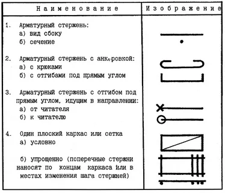

Вводные данные
==============

.. important:: Данное обучающее руководство рассчитано на специалистов, имеющих навыки программирования и способных самостоятельно сконфигурировать рабочие инструменты для создания шаблона.
    
    Шаблон стиля арматурного изделия создан на версии Renga STDL 2.0.

Чтобы лучше понять, как создается шаблон стиля Renga, предлагаем вам пройти данное обучающее руководство, в котором пошагово описан каждый аспект создания пользовательского арматурного изделия.

Для создания данного примера было использовано следующее бесплатное программное обеспечение:

- Текстовый редактор `Visual Studio Code <https://code.visualstudio.com/>`_ для создания файлов описания параметров и STDL-скриптов;
- `Словарь STDL для Visual Studio Code v2.1 <https://github.com/Lex-is-BIM/STDL_snipet>`_ для версии STDL 2.0

Импорт подготовленного шаблона стиля арматурного изделия, скомпилированного в файл ``*.rst``, возможен в `Renga Professional <https://rengabim.com/>`_ версии 8.5 (и старше).

.. note:: Иллюстрации взяты из открытых интернет-источников.

Описание арматурного изделия
----------------------------

.. image:: _static/Pylon_Reinforcing_mesh.png
    :alt: Арматурный каркас пилона
    :scale: 80%
    :class: align-right

Область применения
""""""""""""""""""

Арматурный каркас плоский для армирования монолитных железобетонных пилонов и стен.

Уровни детализации стиля
""""""""""""""""""""""""

1. Детальное.
2. Упрощенное. Автоматически создается Renga.
3. Условное. Выполним по ГОСТ 21.501-93.

Параметры стиля
"""""""""""""""

.. table:: Общие параметры

    +-----------------------+-----------------------------+-----------------------+-----------------------------+
    | Имя параметра         | Тип параметра               | Значение по умолчанию | Диапазон возможных значений |
    +=======================+=============================+=======================+=============================+
    | Длина                 | :ref:`Длина <length_param>` | 2800                  | 100 - 10000                 |
    +-----------------------+-----------------------------+-----------------------+-----------------------------+
    | Ширина                | :ref:`Длина <length_param>` | 160                   | 100 - 10000                 |
    +-----------------------+-----------------------------+-----------------------+-----------------------------+
    | Смещение по вертикали | :ref:`Длина <length_param>` | 0                     | -1000 - 1000                |
    +-----------------------+-----------------------------+-----------------------+-----------------------------+

.. table:: Продольные арматурные стержни

    +---------------------------+-----------------------------+-----------------------+-----------------------------+
    | Имя параметра             | Тип параметра               | Значение по умолчанию | Диапазон возможных значений |
    +===========================+=============================+=======================+=============================+
    | Стиль арматурного стержня | :ref:`ID <id_param>`        |                       |                             |
    +---------------------------+-----------------------------+-----------------------+-----------------------------+
    | Свободный конец снизу     | :ref:`Длина <length_param>` | 50                    | 0 - 10000                   |
    +---------------------------+-----------------------------+-----------------------+-----------------------------+
    | Свободный конец сверху    | :ref:`Длина <length_param>` | 50                    | 0 - 10000                   |
    +---------------------------+-----------------------------+-----------------------+-----------------------------+
    | Длина выпусков            | :ref:`Длина <length_param>` | 0                     | 0 - 10000                   |
    +---------------------------+-----------------------------+-----------------------+-----------------------------+

.. table:: Поперечные арматурные стержни

    +---------------------------+-----------------------------+-----------------------+-----------------------------+
    | Имя параметра             | Тип параметра               | Значение по умолчанию | Диапазон возможных значений |
    +===========================+=============================+=======================+=============================+
    | Стиль арматурного стержня | :ref:`ID <id_param>`        |                       |                             |
    +---------------------------+-----------------------------+-----------------------+-----------------------------+
    | Шаг стержней              | :ref:`Длина <length_param>` | 200                   | 50 - 10000                  |
    +---------------------------+-----------------------------+-----------------------+-----------------------------+
    | Свободный конец арматуры  | :ref:`Длина <length_param>` | 25                    | 0 - 1000                    |
    +---------------------------+-----------------------------+-----------------------+-----------------------------+
