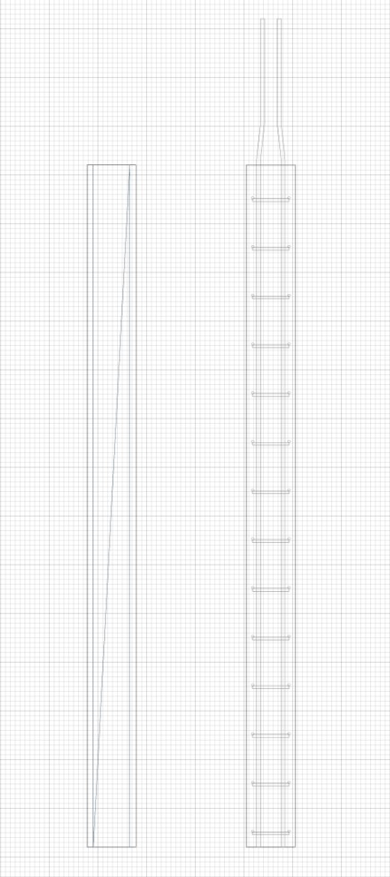

STDL-скрипт
============

Перейдём к описанию динамической части описания шаблона стиля. Это создание скрипта на языке Lua, создающий на основе параметров из ``parameters.json`` стиль объекта.

Создание детальной 3D-геометрии
-------------------------------

1. Объявим несколько локальных переменных, которые помогут проще писать скрипт.

.. code-block:: lua
    :caption: Объявление локальных переменных.
    :linenos:

    -- объявление локальных переменных
    local parameters = Style.GetParameterValues()

    -- таблицы групп параметров
    local general = parameters.General
    local lengthwaysRebars = parameters.LengthwaysRebars
    local transverseRebars = parameters.TransverseRebars

    -- параметры
    local meshLength = general.meshLength
    local meshWidth = general.meshWidth
    local meshOffsetZ = general.meshOffsetZ

    local lengthwaysRebarId = lengthwaysRebars.RebarStyleId
    local dowelLength = lengthwaysRebars.dowelLength

    local transverseRebarId = transverseRebars.RebarStyleId
    local transverseRebarFreeEndLength = transverseRebars.freeEndLength
    local rebarStep = transverseRebars.rebarStep

2. Для размещения продольной и поперечной арматуры относительно друг друга нам нужно знать диаметры стержней, которые выберет пользователь. Поэтому создадим функцию ``GetRebarDiameter``, которая будет получать параметр ``RebarDiameter`` по ID выбранного стиля. И получим диаметры продольной и поперечной арматуры.

.. code-block:: lua
    :caption: Получение диаметров стержней.
    :linenos:

    -- Функция получения диаметра стиля стержня по его ID
    local function GetRebarDiameter(rebarStyleId)
        local style = Project.GetRebarStyle(rebarStyleId)
        local parameters = CastToParameterContainer(style)
        return parameters:GetParameterValues().RebarDiameter
    end

    -- получаем диаметр продольного стержня
    local lengthwaysRebarDiameter = GetRebarDiameter(lengthwaysRebarId)
    -- получаем диаметр поперечного стержня
    local transverseRebarDiameter = GetRebarDiameter(transverseRebarId)

3. Создадим функцию ``makeRebarBaseCurve``, которая будет создавать 3D-кривую, образующую продольный стержень.

.. code-block:: lua
    :caption: Функция создания направляющей для стержня.
    :linenos:

    local function makeRebarBaseCurve()
        local curve
        
        -- если длина выпусков < 200, то создаем прямые стержни
        if dowelLength < 200 then
            return CreateLineSegment3D(Point3D(0, 0, 0), Point3D(0, 0, meshLength + dowelLength))

        -- иначе - с изгибом для правильного соединения с верхним каркасом
        else
            curve = CreatePolyline3D({Point3D(0, 0, 0),
                Point3D(0, 0, meshLength + 30),
                Point3D(lengthwaysRebarDiameter, 0, meshLength + 170),
                Point3D(lengthwaysRebarDiameter, 0, meshLength + dowelLength)})
            FilletCorners3D(curve, 10*lengthwaysRebarDiameter)
            return curve
        end
    end

4. Создадим функцию ``CreateLengthwaysRebars``, создающую продольные стержни. Стержни добавляем в стиль с помощью функции ``AddRebar`` по отдельности.

.. code-block:: lua
    :caption: Функция создания продольных стержней.
    :linenos:

    local function CreateLengthwaysRebars(rebarStyleId)
        local firstCurve = makeRebarBaseCurve()
        local secondCurve = makeRebarBaseCurve()

        -- сами стержни двигаться не могут, поэтому перемещаем образующие кривые на свои места
        firstCurve:Shift(-meshWidth/2 + transverseRebarFreeEndLength, 0, meshOffsetZ)
        secondCurve:Rotate(CreateZAxis3D(), math.pi)
            :Shift(meshWidth/2 - transverseRebarFreeEndLength, 0, meshOffsetZ)

        -- добавляем в стиль стержни
        Style.AddRebar(rebarStyleId, firstCurve)
        Style.AddRebar(rebarStyleId, secondCurve)
    end

5. Создадим функцию ``CreateTransverseRebars``, создающую поперечные стержни. Стержни добавляем в стиль с помощью функции ``AddRebarSet`` одним набором.

.. code-block:: lua
    :caption: Функция создания поперечных стержней.
    :linenos:

    local function CreateTransverseRebars(rebarStyleId)
        -- находим вертикальное смещение первого поперечного стержня
        local rebarOffsetZ = lengthwaysRebars.bottomFreeEndLength + transverseRebarDiameter/2 + meshOffsetZ

        -- находим горизонтальное смещение поперечного стержня относительно продольного
        local rebarOffsetY = (lengthwaysRebarDiameter + transverseRebarDiameter)/2

        -- находим количество поперечных стержней
        local layoutLength = meshLength - rebarOffsetZ - lengthwaysRebars.topFreeEndLength
        local rebarsQty = math.ceil(layoutLength/rebarStep)

        -- создаем направляющую кривую
        local curve = CreateLineSegment3D(Point3D(-meshWidth/2, -rebarOffsetY, rebarOffsetZ),
            Point3D(meshWidth/2, -rebarOffsetY, rebarOffsetZ))

        -- добавляем в стиль набор стержней
        Style.AddRebarSet(rebarStyleId, curve, Vector3D(0, 0, 1), rebarStep, rebarsQty)
    end

6. Вызовем созданные функции и создадим детальное отображение арматурного каркаса.

.. code-block:: lua
    :caption: Создаем с помощью функций продольную и поперечную арматуру каркаса.
    :linenos:

    -- создание продольных стержней
    CreateLengthwaysRebars(lengthwaysRebarId)

    -- создание поперечных стержней
    CreateTransverseRebars(transverseRebarId)

Создание условного изображения
------------------------------

7. Создадим экземпляр класса ``ModelGeometry``, в котором будем "собирать" условную геометрию стиля. Условное изображение шаблона будет двумерной геометрией ``GeometrySet2D``.

.. code-block:: lua
    :caption: Создание условной геометрии.
    :linenos:

    -- создание экземпляра ModelGeometry
    local symbolicGeometry = ModelGeometry()

    -- создание экземпляра планарной геометрии
    local geometry = GeometrySet2D()

    -- задание ЛСК
    local geometryPlacement = Placement3D(Point3D(0, 0, meshOffsetZ), Vector3D(0, -1, 0), Vector3D(1, 0, 0))

8. Условное изображение будет состоять из прямоугольника и диагональной линии. Поместим созданные кривые в двумерную геометрию с помощью метода ``AddCurves``.

.. code-block:: lua
    :caption: Создание элементов условной геометрии.
    :linenos:

    local rectangle = CreateRectangle2D(Point2D(0, meshLength/2), 0, meshWidth, meshLength)
    local line = CreateLineSegment2D(Point2D(-meshWidth/2, 0), Point2D(meshWidth/2, meshLength))

    -- добавление кривых в планарную геометрию
    geometry:AddCurve(rectangle):AddCurve(line)

    -- добавление планарной геометрии в модельную геометрию
    symbolicGeometry:AddGeometrySet2D(geometry, geometryPlacement)

Cозданную двумерную геометрию ``geometry`` добавляем в модельную геометрию ``symbolicGeometry`` с помощью метода ``AddGeometrySet2D``.

9. Для создания условной геометрии стиля, передадим модельную геометрию ``symbolicGeometry`` в качестве аргумента функции SetSymbolicGeometry.

.. code-block:: lua
    :caption: Создание условной геометрии стиля.
    :linenos:

    -- создание условной геометрии стиля
    Style.SetSymbolicGeometry(symbolicGeometry)