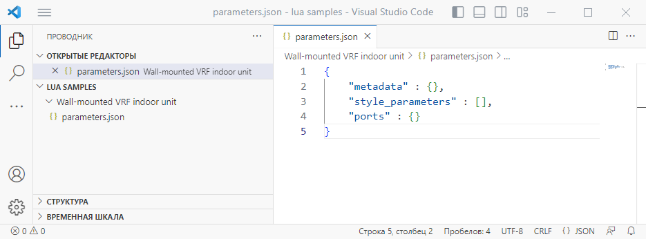
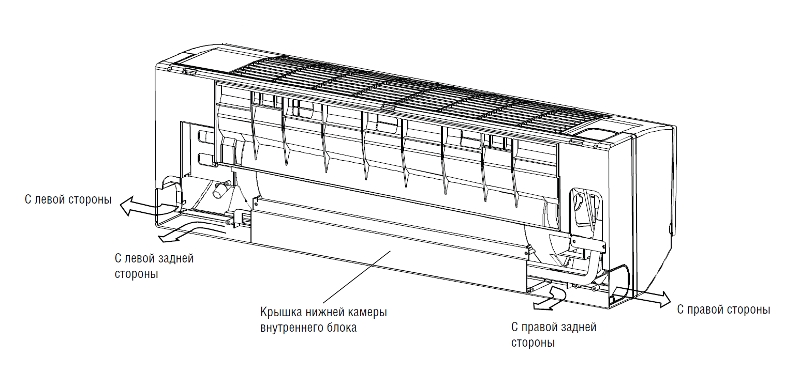
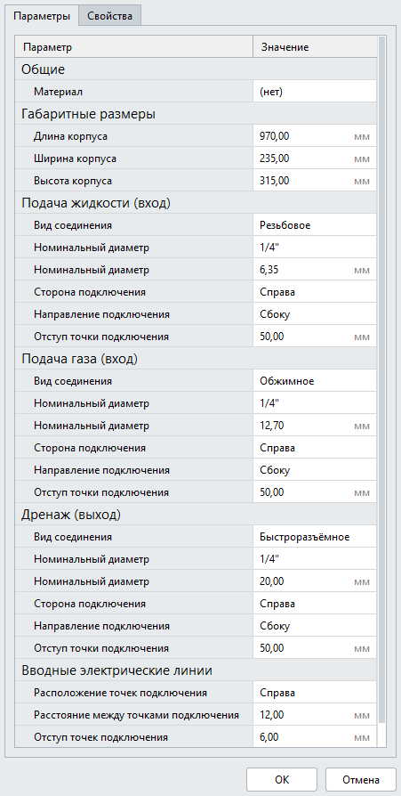
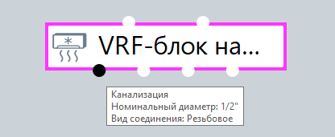
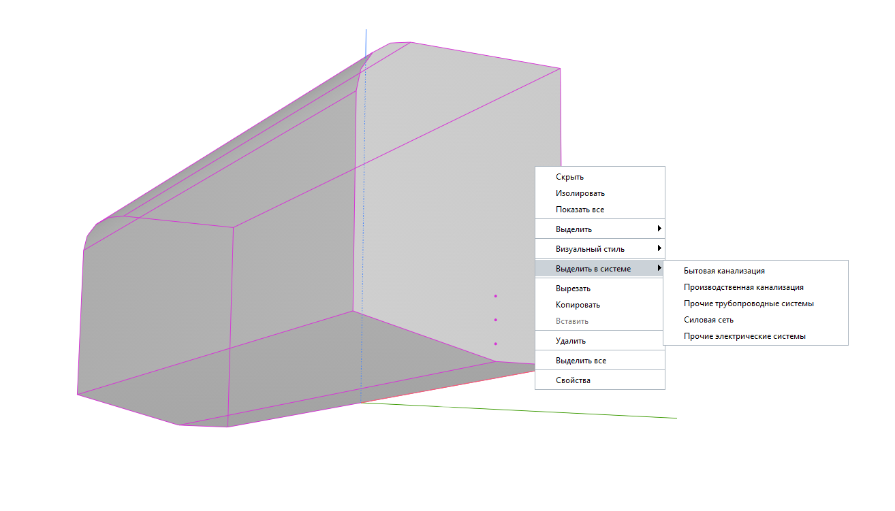

parameters.json
===============

Перейдём к описанию статической части описания шаблонной категории. Это создание параметров, с помощью которых пользователь будет управлять формой оборудования и точками подключения в диалоге стиля объекта Renga.

1. В рабочей среде редактора создадим папку с названием будущего оборудования ``Wall-mounted VRF indoor unit`` и создадим в ней файл ``parameters.json``. Добавим в файл объект ``metadata`` и массивы ``style_parameters``, ``ports``.

    Создание файла ``parameters.json``

2. Заполним объект ``metadata`` информацией о шаблоне. Добавим атрибут ``default_name`` — название по-умолчанию в списке стилей объекта (его можно изменить после импорта в Renga). Также добавим (не редактируемые в Renga) атрибуты ``description``, ``version`` и ``author`` — они будут отображаться только в диалоге "Категории" при загрузке шаблона категории в Renga.

.. code-block::
    :caption: Внесение информации о шаблоне в объект ``metadata``
    :linenos:

    "metadata" : {
        "default_name" : "Настенный блок VRF",
        "description" : "Внутренний блок настенного типа мультизональных VRF-систем",
        "version" : "1.0.0",
        "author" : "Иванов Иван Иванович"
    }

3. Создадим группы параметров, которые будут отображаться в диалоге стиля объекта.

.. admonition:: Соглашение об описании параметров

    Для унификации отображения параметров в диалоге стиля объекта принято группу "Общие" делать первой в списке, второй — группу "Габаритные размеры", а затем указывать группы "Порты" или "Точки подключения".

.. code-block::
    :caption: Создание групп параметров в массиве ``style_parameters``
    :linenos:

    "style_parameters" : [
            {
                "name" : "General",
                "text" : "Общие",
                "params" : []
            },
            {
                "name" : "Dimensions",
                "text" : "Габаритные размеры",
                "params" : []
            },
            {
                "name" : "WaterCoolant",
                "text" : "Подача жидкости (вход)",
                "params" : []
            },
            {
                "name" : "GasCoolant",
                "text" : "Подача газа (вход)",
                "params" : []
            },
            {
                "name" : "Drainage",
                "text" : "Дренаж (выход)",
                "params" : []
            },
            {
                "name" : "ElectricConnectors",
                "text" : "Вводные электрические линии",
                "params" : []
            }
        ]

4. Добавим в группу "Общие" параметр "Материал" типа :ref:`Link <link_param>` для задания пользователем материала оборудования.

.. code-block::
    :caption: Добавление в группу "Общие" параметра ``material``
    :linenos:

    {
        "name" : "General",
        "text" : "Общие",
        "params" : [
            {
                "name" : "material",
                "text" : "Материал",
                "type" : "link",
                "entity_type_id" : "0abcb18f-0aaf-4509-bf89-5c5fad9d5d8b"
            }
        ]
    }

5. Добавим в группу "Габаритные размеры" параметры типа :ref:`Length <length_param>`, которые будут управлять длиной, шириной и высотой оборудования.

.. code-block::
    :caption: Добавление в группу "Габаритные размеры" параметров ``body_length``, ``body_width`` и ``body_height``
    :linenos:

    {
        "name" : "Dimensions",
        "text" : "Габаритные размеры",
        "params" : [
            {
                "name" : "body_length",
                "text" : "Длина корпуса",
                "type" : "length",
                "default" : 970,
                "min" : 100,
                "max" : 2000
            },
            {
                "name" : "body_width",
                "text" : "Ширина корпуса",
                "type" : "length",
                "default" : 235,
                "min" : 100,
                "max" : 2000
            },
            {
                "name" : "body_height",
                "text" : "Высота корпуса",
                "type" : "length",
                "default" : 315,
                "min" : 100,
                "max" : 2000
            }
        ]
    }

6. Опишем параметры группы ``WaterCoolant``. Добавим параметр ``connector_type`` типа :ref:`Enumeration <enumeration>` для указания вида соединения (из списка возможных в Renga). И ещё два параметра, которые будут задавать номинальный диаметр соединения: ``thread_size`` типа :ref:`Enumeration <enumeration>` и ``nominal_diameter`` типа :ref:`Length <length_param>`.

.. note:: Далее в скриптах Lua пропишем логику, чтобы в диалоге стиля объекта отображался только один параметр (thread_size или nominal_diameter), в зависимости от того, какой вид соединения выберет пользователь. 

.. code-block::
    :caption: Добавление в группу "Подача жидкости (вход)" параметров соединения
    :linenos:

    {
        "name" : "WaterCoolant",
        "text" : "Подача жидкости (вход)",
        "params" : [
            {
                "name" : "connector_type",
                "text" : "Вид соединения",
                "type" : "enumeration",
                "enum_type" : "ConnectorType",
                "default" : "Thread"
            },
            {
                "name" : "thread_size",
                "text" : "Номинальный диаметр",
                "type" : "enumeration",
                "enum_type" : "PipeThreadSize",
                "default" : "D0_50"
            },
            {
                "name" : "nominal_diameter",
                "text" : "Номинальный диаметр",
                "type" : "length",
                "default" : 6.35,
                "min" : 1,
                "max" : 100
            },
            ..
        ]
    }

.. note:: Причиной создания двух параметров для задания номинального диаметра является то, что при резьбовом виде соединения диаметр указывается в дюймах (из списка возможных вариантов), а во всех остальных случаях вводится пользователем в миллиметрах:
 
    .. csv-table::
        :widths: auto
        :align: center
        :header: "thread_size", "nominal_diameter"

        .. image:: _static/thread_size.png, .. image:: _static/nominal_diameter.png

Ещё важным моментом в подключении блоков к инженерным системам является — сторона подключения (слева или справа) и направление подключения (сбоку, сзади, снизу).

    Подключение трубопроводов к внутреннему блоку

Как правило, патрубки, соединяющие трубопроводы с оборудованием, располагаются в корпусе блока. Мы их моделировать не будем, но возможность управлять ориентацией и расположением портов добавим, для того, чтобы трубопроводы могли "подойти" к корпусу с нужной стороны.

Добавим ещё три параметра. Параметр ``connection_side`` типа :ref:`List <list>` будет состоять из вариантов ``["Слева", "Справа"]``. Параметр ``connection_direction`` типа :ref:`List <list>` будет состоять из вариантов ``["Сбоку", "Сзади", "Снизу"]``. А параметр ``port_indentation`` будет задавать отступ точек подключения от задней стенки блока.

.. code-block::
    :caption: Добавление в группу "Подача жидкости (вход)" параметров ``connection_side``, ``connection_direction`` и ``port_indentation``
    :linenos:

    {
        "name" : "WaterCoolant",
        "text" : "Подача жидкости (вход)",
        "params" : [
            ..
            {
                "name" : "connection_side",
                "text" : "Сторона подключения",
                "type" : "list",
                "default" : "right",
                "items" : [
                    {
                        "key" : "right",
                        "text" : "Справа"
                    },
                    {
                        "key" : "left",
                        "text" : "Слева"
                    }
                ]
            },
            {
                "name" : "connection_direction",
                "text" : "Направление подключения",
                "type" : "list",
                "default" : "side",
                "items" : [
                    {
                        "key" : "side",
                        "text" : "Сбоку"
                    },
                    {
                        "key" : "back",
                        "text" : "Сзади"
                    },
                    {
                        "key" : "below",
                        "text" : "Снизу"
                    }
                ]
            },
            {
                "name" : "port_indentation",
                "text" : "Отступ точки подключения",
                "type" : "length",
                "default" : 50,
                "min" : 0,
                "max" : 200
            }
        ]
    }

7. Следующие две группы параметров ``GasCoolant`` и ``Drainage`` также описывают подключение к трубопроводным системам. Поэтому мы можем использовать аналогичные параметры для задания соединения ``connector_type``, ``nominal_diameter``, ``thread_size``, ``connection_side``, ``connection_direction`` и ``port_indentation``. Скопируем их из группы ``WaterCoolant`` и присвоим характерные значения по-умолчанию ``default``.

.. important:: В параметре ``connector_type`` мы использовали список идентификаторов для создания видов соединения к трубопроводным системам. Для создания видов соединения к вентиляционным системам необходимо использовать ``"enum_type" : "AirConnectorType"`` со своим списком вариантов. См. :doc:`идентификаторы системных перечислений </coreenums>`

8. Перейдём к описанию параметров соединения с электрическими системами группы ``electric_connectors``. В описании оборудования мы определили, что будет 3 точки подключения (к силовой сети, сети управления/связи и проводному пульту управления). Добавим в статической части характерные параметры для этих точек подключения: расположение ``port_location`` и расстояние между ними ``distance_between_ports``, ``port_indentation``.

Параметр ``port_location`` типа :ref:`List <list>` будет состоять из вариантов ``["Слева", "Справа"]``.

Направление электрических портов будет фиксированным — назад. Параметры для управления направлением добавлять не будем.

.. code-block::
    :caption: Добавление в группу "Вводные электрические линии" параметров соединения
    :linenos:

    {
        "name" : "ElectricConnectors",
        "text" : "Вводные электрические линии",
        "params" : [
            {
                "name" : "port_location",
                "text" : "Расположение точек подключения",
                "type" : "list",
                "default" : "right",
                "items" : [
                    {
                        "key" : "right",
                        "text" : "Справа"
                    },
                    {
                        "key" : "left",
                        "text" : "Слева"
                    }
                ]
            },
            {
                "name" : "distance_between_ports",
                "text" : "Расстояние между точками подключения",
                "type" : "length",
                "default" : 12,
                "min" : 0,
                "max" : 30
            },
            {
                "name" : "port_indentation",
                "text" : "Отступ точек подключения",
                "type" : "length",
                "default" : 6,
                "min" : 0,
                "max" : 200
            }
        ]
    }

Параметры стиля описаны. После импорта в Renga, наш список параметров в диалоге стиля объекта примет такой вид:

    Параметры стиля объекта Renga.

Пока еще есть задвоение параметров *Номинальный диаметр*. В дальнейшей работе, в скриптах Lua мы настроим отображение нужного нам параметра.

9. Осталось описать порты в массиве ``ports``. У нас есть 6 портов, перечислим их:

.. code-block::
    :caption: Перечисление портов в группе ``ports``
    :linenos:

    {
        "ports" : [
            {
                "name" : "WaterCoolant"
            },
            {
                "name" : "GasCoolant"
            },
            {
                "name" : "Drainage"
            },
            {
                "name" : "PowerSupplyLine"
            },
            {
                "name" : "ControlNetwork1"
            },
            {
                "name" : "ControlNetwork2"
            }
        ]
    }

.. note:: Имя портам даётся уникальное и понятное. Оно является ключом для доступа к его параметрам.

Рассмотрим подробнее на примере порта ``Drainage`` для чего нужны параметры порту.

.. code-block::
    :caption: Перечисление атрибутов порта ``Drainage``
    :linenos:

    {
        "ports" : {
            ..
            {
                "name" : "Drainage",
                "text" : "Канализация",
                "flow_direction" : "Outlet",
                "system_categories" : [
                    "DomesticSewage",
                    "IndustrialSewage",
                    "OtherPipeSystem"
                ]
            },
            ..
        }
    }

Параметр ``text`` задает отображаемое имя порта в Renga. Его лучше сопоставить с названиями категорий систем в Renga, чтобы проектировщику было легче ориентироваться при работе во вкладках систем.

Пример:|pic2|

Параметры ``flow_direction`` и ``system_categories`` описаны в разделе :ref:`Определение точек подключения <flow>`.

.. note:: Понятие *Направление потока* или ``flow_direction`` не применяется к электрическим системам. При описании электрических портов этот параметр можно не указывать.

В массиве ``system_categories`` перечисляются идентификаторы категорий систем, к которым будет возможно подключить данный порт. Соответственно, варианты подключения оборудования к другим системам будут не доступны.

    Доступные варианты систем, к которым можно подключить оборудование.

10. Полное описание портов:

.. code-block::
    :caption: Описание портов в массиве ``ports``
    :linenos:

    {
        "ports" : [
            {
                "name" : "WaterCoolant",
                "text" : "Жидкостный трубопровод",
                "flow_direction" : "Inlet",
                "system_categories" : [
                    "OtherPipeSystem"
                ]
            },
            {
                "name" : "GasCoolant",
                "text" : "Фреоновый трубопровод",
                "flow_direction" : "Inlet",
                "system_categories" : [
                    "OtherPipeSystem"
                ]
            },
            {
                "name" : "Drainage",
                "text" : "Канализация",
                "flow_direction" : "Outlet",
                "system_categories" : [
                    "DomesticSewage",
                    "IndustrialSewage",
                    "OtherPipeSystem"
                ]
            },
            {
                "name" : "PowerSupplyLine",
                "text" : "Силовая линия",
                "system_categories" : [
                    "PowerCircuit"
                ]
            },
            {
                "name" : "ControlNetwork1",
                "text" : "Линия управления 1",
                "system_categories" : [
                    "OtherElectricalSystem"
                ]
            },
            {
                "name" : "ControlNetwork2",
                "text" : "Линия управления 2",
                "system_categories" : [
                    "OtherElectricalSystem"
                ]
            }
        ]
    }